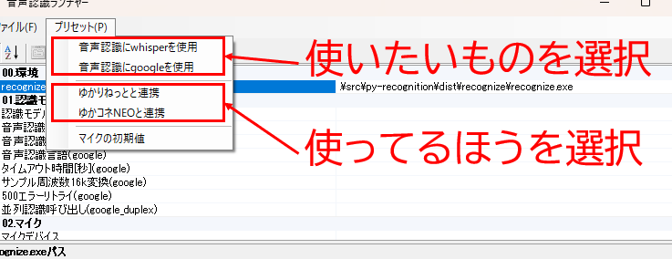
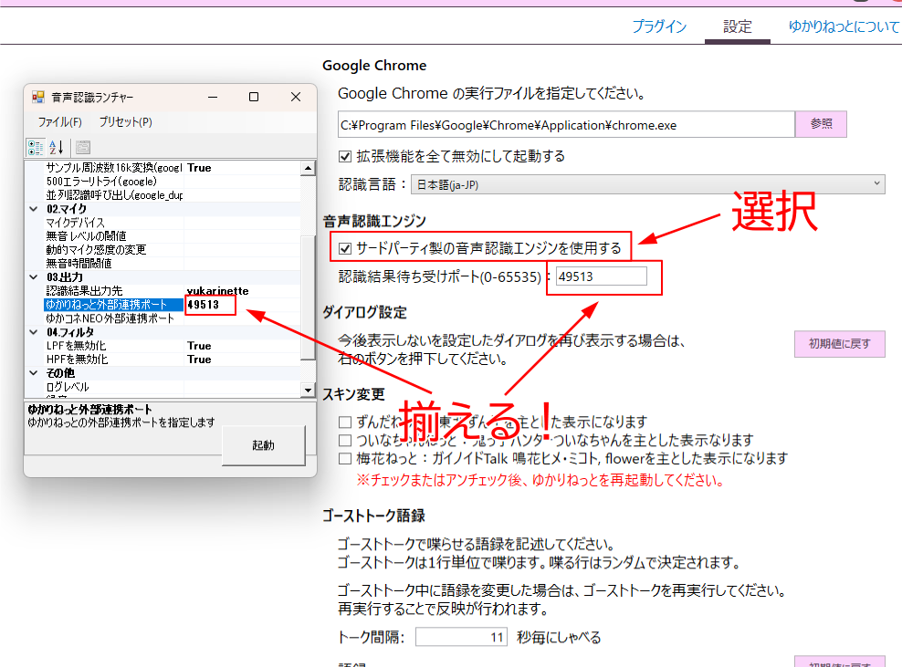

# 簡単スタート

## まずビルド！
最初にexeファイルを作る必要があります。  
ダウンロードしたZIPファイルを解凍すると中にbuild-all.batがあるのでダブルクリックで実行します。結構時間かかる！  
※この作業はアップデートした場合再度行う必要があります。  
※ビルド時exeを作成する都合上、一時的に10G弱ほど容量を使用します。実行するドライブの容量にお気を付けください。  
※最終的なexeのサイズは4G程度ですが、whisperを使用する場合学習ファイルを別途ダウンロードします。  
※アンチウィルスソフトによりビルドが上手くいかない場合があります。その場合は除外対象等設定をお願いします。  

batファイルのウインドウは適当にキーを押せば閉じます。

### python, VC++の自動インストール
ビルドバッチはpythonが見つからない場合Microsoft Storeよりpython 3.11.xをC++コンパイラが見つからない場合Visual Studio Build Toolsを自動的にインストールします。Cドライブの空き容量にお気を付けください。

## 認識する準備！
recognize-gui.exeをダブルクリックで実行します。  
プリセットから簡易設定を行いましょう。

※whisperを実用的に使うにはPCにNVIDIAのGPUが搭載されている必要があります

### 認識モデル
認識モデルはプリセット選択後以下のように表示されていればOKです！

### \[ゆかりねっと限定\]外部連携の設定！

※ゆかコネNEOは自動で連携するので通常必要ありません

## マイクの調整！

### マイクデバイスの選択！
マイクデバイスをプルダウンすると接続されている入力デバイスの一覧が並ぶので使っているものを選択します。  
このデバイスは出力含むサウンドデバイスに変更があると順序が変わり再度選択する必要があるのでDACなど抜き差ししている人は特に注意してください！

### 環境音の測定！
メニューから環境音の測定を実施します。このときしゃべらず結果が出るのを待ってください。環境音測定画面に環境音から計算した閾値が出ているのでそれを画面に入力します。

<<画像を入れる>>

### そして認識テスト！
メニューからマイクテストを実施します。

<<画像を入れる>>

どうですか？しゃべり終わったタイミングで認識が終了しましたか？認識できる声量が出ているとインジケータの色が緑色にそして声を認識すると水色に変化します。緑色に変わらない場合は閾値を水色に変わらない場合はノイズがうるさすぎる可能性があります。Windowsのマイクボリュームを見直してください。

どういう音が認識しているか確認したい場合カテゴリそのほかにある\[録音\]をTrueにしてテストを実行すると認識した音声データをwavファイルを保存します。これを聞いて無駄がないか確認しましょう！  
※ このオプションはゆかりねっと連携時も有効でwavで保存するので必要ない場合はFalseに設定して録音されないようにしましょう

## マイクのパラメータの意味をもっと知りたい！
[マイクのドキュメント](mic.md)用意してあります！

## ゆーかねすぴれこで認識してゆかりねっとでしゃべらせる！
これで準備ができたのでいよいよゆかりねっとでボイロ(等)にしゃべらせましょう。
1. まずゆかりねっとで認識を開始します
2. 起動ボタンをクリックして本体を起動します
3. 認識中の表示が出たらなにかしゃべってみます
4. それに合わせてボイロがしゃべる…！

どうですか？問題なく動きましたか？設定はここまでです。お疲れさまでした…！  
設定は保存されるので次回からは起動ボタンだけでOKですよ！