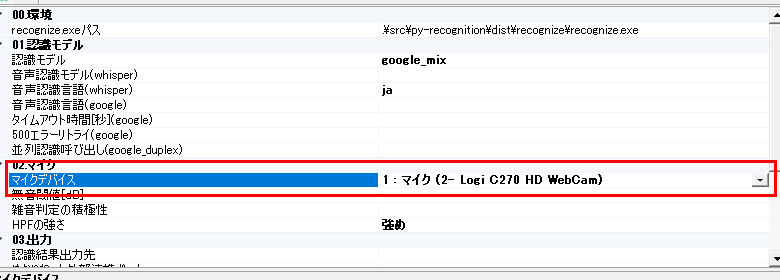

# 簡単スタート

## まずビルド！
最初にexeファイルを作る必要があります。  
ダウンロードしたZIPファイルを解凍すると中にbuild-all.batがあるのでダブルクリックで実行します。結構時間かかる！  
※この作業はアップデートした場合再度行う必要があります。  
※ビルド時exeを作成する都合上、一時的に10G弱ほど容量を使用します。実行するドライブの容量にお気を付けください。  
※最終的なexeのサイズは4G程度ですが、whisperを使用する場合学習ファイルを別途ダウンロードします。  
※アンチウィルスソフトによりビルドが上手くいかない場合があります。その場合は除外対象等設定をお願いします。  
途中pythonのインストールを尋ねられることがあります。この場合インストールしてください。

batファイルのウインドウは適当にキーを押せば閉じます。

## 認識する準備！
recognize-gui.exeをダブルクリックで実行します。  
プリセットから簡易設定を行いましょう。

### 認識モデル
認識モデルはプリセット選択後以下のように表示されていればOKです！

### \[ゆかりねっと限定\]外部連携の設定！

※ゆかコネNEOは自動で連携するので通常必要ありません

## マイクの調整！

### マイクデバイスの選択！
マイクデバイスをプルダウンすると接続されている入力デバイスの一覧が並ぶので使っているものを選択します。同じデバイスが複数見えますが認識に使用するOSの方法が異なります。\[MME\]と\[WASAPI\]での動作を確認していますよ！  
このデバイスは出力含むサウンドデバイスに変更があると順序が変わり再度選択する必要があるのでDACなど抜き差ししている人は特に注意してください！

※文字化けしているのは使用しているコンポーネントの問題のため現時点では仕様です

### 最低音声認識時間と発声を止めたと認識するための無音時間の設定！
難しそうですがひとまずプリセットで初期値を入れられます。

### まず認識テスト！
メニューからマイクテストを実施します。

どうですか？しゃべり終わったタイミングで認識が終了しましたか？ここで遅れが発生する、または早く終了する場合は次の\[無音レベルの閾値調整！\]に進みます。問題がない場合は次節はスキップして問題ありません。

どういう音が認識しているか確認したい場合カテゴリそのほかにある\[録音\]をTrueにしてテストを実行すると認識した音声データをwavファイルを保存します。これを聞いて無駄がないか確認しましょう！  
※ このオプションはゆかりねっと連携時も有効でwavで保存するので必要ない場合はFalseに設定して録音されないようにしましょう

## マイクのパラメータの意味をもっと知りたい！
[マイクのドキュメント](mic.md)用意してあります！

## ゆーかねすぴれこで認識してゆかりねっとでしゃべらせる！
これで準備ができたのでいよいよゆかりねっとでボイロ(等)にしゃべらせましょう。
1. まずゆかりねっとで認識を開始します
2. 起動ボタンをクリックして本体を起動します
3. 認識中の表示が出たらなにかしゃべってみます
4. それに合わせてボイロがしゃべる…！

どうですか？問題なく動きましたか？設定はここまでです。お疲れさまでした…！  
設定は保存されるので次回からは起動ボタンだけでOKですよ！